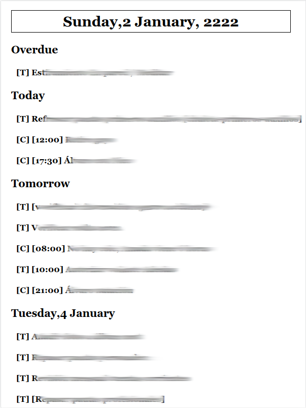

# productivity-dashboard

Just a simple PHP/Laravel app that retrieves (so far) tasks from Todoist and displays them in a simple view designed for a Kindle Touch.

All the settings are configured in the .env file (check .env-sample).

## Features

### Todoist specific

You can customize the filter (TODOIST_FILTER) used in the API call.

### Group by date

The elements are grouped in for type of elements:

- Overdue elements.
- Elements due today.
- Elements due tomorrow
- The rest

You can customize (localize) the keyword applied to every category of element:

* APP_LOCALE_OVERDUE
* APP_LOCALE_TODAY
* APP_LOCALE_TOMORROW
* APP_LOCALE_OTHERS_MASK

### Other

* The view will autorefresh every 1800 seconds. You can change that setting in REFRESH_RATE_IN_SECONDS.
* Every element will be truncated if the string is longer than ELEMENT_MAX_LENGHT.
* Clicking on the header will refresh the view.

## Tested Devices

I use this app with a jailbroken Kindle Touch + KUAL + Weblaunch.

## TODO

- Make the elements clickable so todoist tasks can be completed.
- Add Google Calendar support
- Prettier UI
- Propper localization
